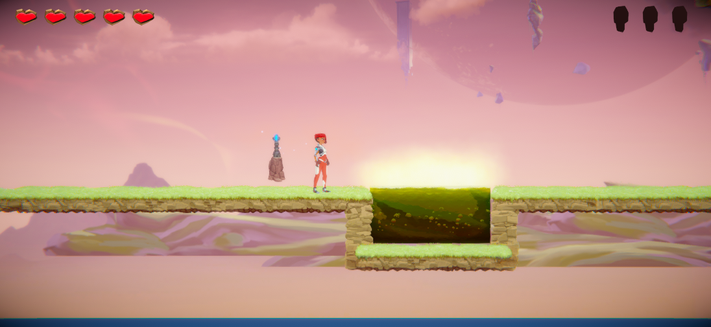
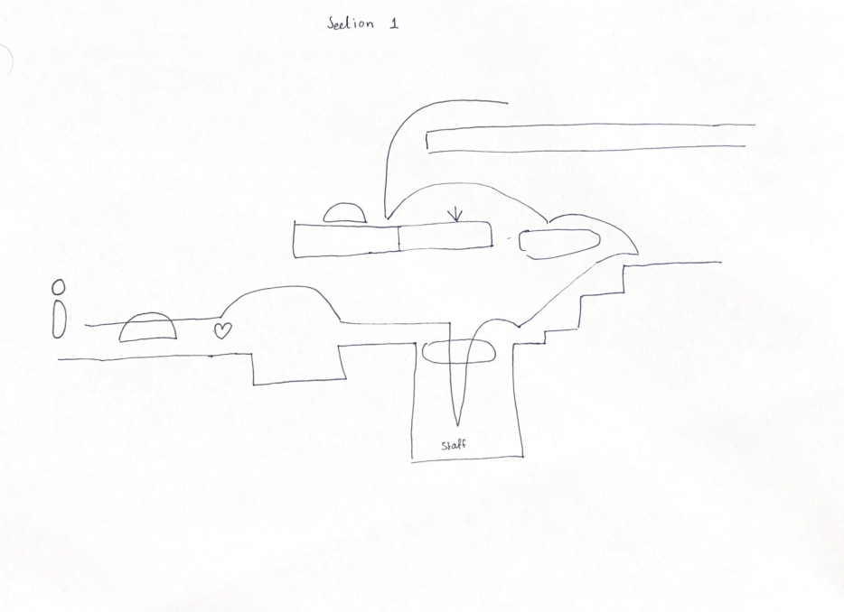

# COMP2150  - Level Design Document
### Name: Faizan E Muhammad
### Student number: 47752440

## 1. Player Experience (~700 words)

### 1.1. Discovery

Initially, in section 1, the player learns about the core mechanics and dynamics of the game such as movement, interaction with the different kinds of platforms and achieving the goal of collecting the key in each section. They also learn about the dynamics by combining the movements and interactable objects i.e. the interaction with the passthrough platform where the player has to use the movement S key and the space key to passthrough the platform.

The player also learns by recognizing patterns in the game and developing skills to solve challenges. For example, the player learns that if they jump too early over the acid they will fall into the acid so they develop the skill to time their jumps.

The player learns about the blend of easy and hard fun with their being a progressive increase in difficulty providing the player with a satisfying player experience.

The above practices help in facilitating learning for the player in a way that good design practices are followed.

### 1.2. Drama
The level features an increasing intensity curve where there are moments of relief in each section of the game. 

Each section has been designed to facilitate a gradual build where at the start of each level the player faces easier challenges compared to the later parts of the section. For example, in section three the player is introduced to a simple obstacle of jumping over the acid but as the player moves forward they need to perform more precise jumps to progress which also helps in the tension relief, the tension is high when the player is trying to make the jump but as soon as the player successfully lands the jump the tension is relieved. 

The failure to clear the obstacle and losing health or the reward of collecting the key is organized in such a way that it adds to the intensity curve.

The combination of these design choices facilitates increasing yet modulating intensity.

### 1.3. Challenge

The main challenges of the level are skill-based challenges where the player has to move the player precisely with timed jumps and strategically position the player for the start point of the jump if the player is positioned too far they might not get their desired result from the jump. 

There are also stressors and other difficulties involved such as the three moving platforms from section 2 where each of the platforms is set to a different movement speed adding further timing-related stress for the player.

To balance the challenges and control the difficulty curve the level design includes a gradual introduction to the challenge and increases the difficulty with further progress. An example is of the moving platforms from section 2 where the lowest platform has the slowest movement speed allowing for the player to understand and learn their objective and the middle platform has an increased speed and the last platform is the fastest, hinting at a gradual increase in difficulty.

### 1.4. Exploration
The sense of autonomy and the invitation to exploration have been incorporated using multiple design choices.

Multiple interactive elements have been used in each section of the level i.e. the moving platform and pass-through platforms which encourage the player to interact with the environment around them and also explore different strategies.

The sections have been designed in such a way that the player is guided visually to the goal of that section i.e. collecting the keys. Each section has a clear pathway that the player can comprehend and manoeuvre to achieve the goal.

A hidden area with a reward has also been implemented in section 3 of the level where the player can enter and collect the health pickup as a reward.

Each section has a distinct aesthetic and layout that aids in creating memorable space. For example, section 2 can be remembered by the player as the section with the acid floor and section 3 can be remembered as the underground dungeon section of the level. These sections would help the player remember these spaces even after completing the game.

## 2. Core Gameplay (~400 words)

### 2.1. Acid and Checkpoints
The acid and checkpoint were introduced at the start as it helps the player understand at the beginning that when they die they start at their last checkpoint and acid aids in that. 

 

### 2.2. Chompers
The chomper was introduced to the player at this stage as the player has no choice other than passing through the chomper, which also helps them learn that a melee enemy decreases the player's health by one heart.

### 2.3. Health Pickups and Passthrough Platform
The passthrough platform and the health pickup are introduced in this section as the player would have already lost some health from the acid and the chomper so after accessing the health pickup they will regain some health. The passthrough platform hints the player on accessing such pickups when they are below the floor. 

### 2.5. Keys and Moving Platforms
The moving platform was introduced in this part as it made the player learn that they must time their movement to escape this section. The key was there as small goal that the player has to achieve by overcoming the challange of the moving platform.

### 2.6. Spikes, Weapon pickup (Staff) and Spitters
The player now has to jump to the next platform but there are spikes in the way, if they time their jump correctly they can avoid the spikes otherwise they land on them and loose health. If they time their jump correctly they land on the Weapon pickup (Staff) but as they pickup the weapon they get damaged by the spitter but since they have the staff they can attack the spitter and kill them. The above series of events are connected and help the player in this section learn about weapons, spikes and spitters.

## 3. Spatiotemporal Design
A section on Spatiotemporal Design, which includes your molecule diagram and annotated level maps (one for each main section of your level). These diagrams may be made digitally or by hand, but must not be created from screenshots of your game. The annotated level maps should show the structure you intend to build, included game elements, and the path the player is expected to take through the level. Examples of these diagrams are included in the level design lectures.

No additional words are necessary for this section (any words should only be within your images/diagrams).
 
### 3.1. Molecule Diagram

### 3.2. Level Map – Section 1

### 3.3.	Level Map – Section 2

### 3.4.	Level Map – Section 3

## 4. Iterative Design (~400 words)
Iterative design can be a powerful tool in improving the level design. In this case, the iterative design helped me set goals for each iteration and achieve them by the end of each iteration. For example, while storyboarding I placed the health pickup where I thought it would be the most beneficial for the level, however by playtesting the level multiple times in multiple iterations it was revealed to me that the initial placements for the health pickup need to be changed in such way that they appear after an encounter where the player has taken or received some damage. The iterative design also helped me in deciding where to place the checkpoints, In each iteration with playtesting I found out that the best place for the checkpoints is before the next encounter or where the player has completed some obstacle. Each iteration also helped me evaluate the difficulty of that section and allowed me to adjust the difficulty curve to match the aimed player experience. 

In my iterative process for making each section, I started by looking at different gameplays online for platformers to take inspiration from, later, I made a storyboard for what I wanted to achieve with that particular section. Then I made a prototype section in Unity to test out the storyboard and based on the playtesting I evaluated the issues i.e. the gap to jump is too narrow that the player can walk over it.  With the evaluation I set the goals for the next iteration similarly with each iteration, I got a better knowledge and understanding of the section I wanted to design. With a refined storyboard after evaluating the previous iterations I designed a level map and started Implementing it in unity. After that, I playtested the level multiple times to find any bugs and tried to resolve them.

Below are some of the earlier storyboards:

Changes:

Section 1: I changed the height of the platform where the key is located as I found a bug where the player was able to jump to the key.

Section 2:  I changed the distances from the top moving platform to the platform with the checkpoint as I found that if the platform moved too close to the other platform it decreased the game's difficulty.

Section 3: I changed the location of the key door as the depth of the level was not able to fit the key door and falling on the platform after collecting the key without getting hit by the spikes was nearly impossible which would have increased the difficulty more than aimed for. 

In the future iteration the placement of the enemies, health pickups, weapon pickups and checkpoints can be vastly improved. For example, the weapons in my level design are not that useful as all of my sections are more focused on obstacle avoidance.

